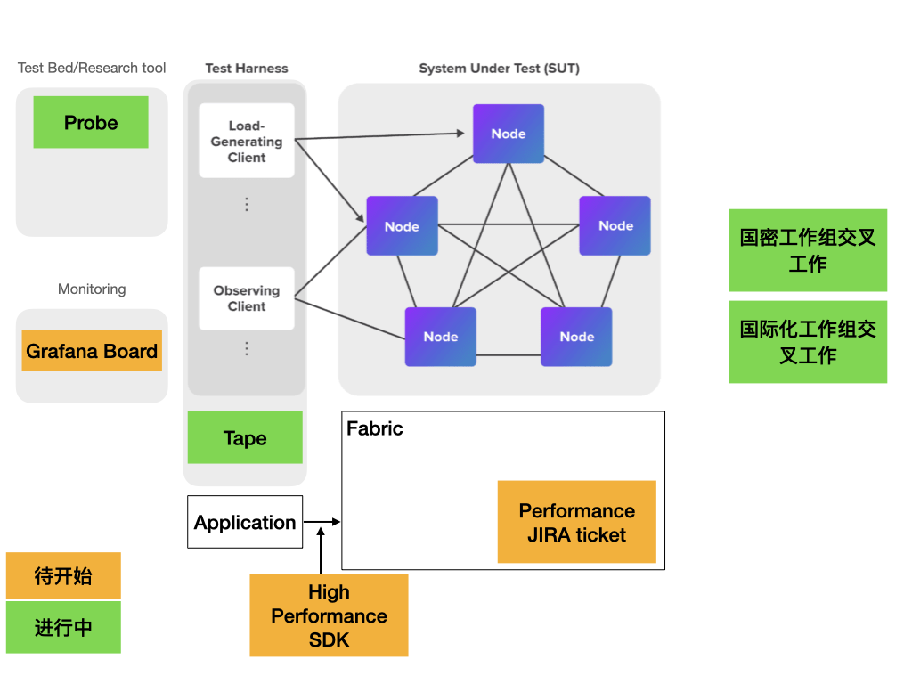

# 工作流程：
调研->优化->测试->对外发布结果->pr回主干/rfc（开放给所有朋友）

# 工作内容
- 已知jira issue @李明轩
- 基于性能测试白皮书的展开工作（理论-》实践-》测试-》结果可视化）
  - Grafana Dash Board（new project）--》 可视化展示
  - 基于白皮书理论的sdk优化工作，高性能SDK（如Go SDK），如cache //面向终端程序
  - 《HL_Whitepaper_Metrics_PDF_V1.01》更新迭代，新添加指标，测试方式
- 现有测试工具维护升级

# 工作形式：
- 开放issue/ticket方式在github上，大家领取任务。提交报告回https://github.com/Hyperledger-TWGC/fabric-performance-wiki
-  定期meet up（回馈机制）季度为周期，形式上：meetup、通讯稿（博客、文章）

# 与TWGC其他SIG交叉工作部分：
- 与i18n组交叉，相关文档翻译（提交回https://github.com/Hyperledger-TWGC/fabric-performance-wiki）

- 与国密组的交叉工作：
  - 测试工具的国密改造（Tape）
  - 基础库的benchmark
  - golang基础库性能优化

# 其他：
- 其他Hyperledger项目的测试工具（调研...？？）
- 调研：（优化方案 & 交流平台）
test bed，比如断网，测恢复时间，资源使用（service mesh?+ 混沌？/chaos mesh）
常见扩容手段研究，技术性推荐；(目前空白)
通道，合约
