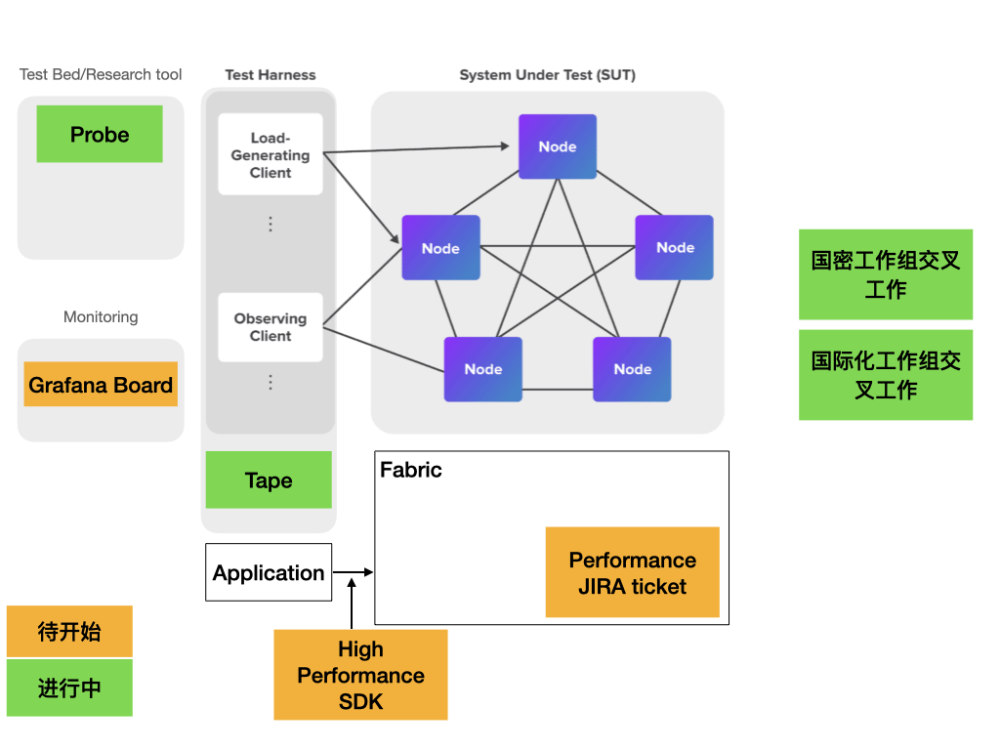

## 项目背景和目标

随着 Fabric 的使用已经越来越广泛，Fabric 性能问题也日益凸显，为了更好的研究和优化 Fabric 性能问题，2020年7月13日，TWGC 成立了性能优化小组以便为大家提供优化方案和参考实现。

## 重要文件

- 思路汇总

主要从两个方面探索Fabric性能的优化方案:Fabric 项目自身性能和 Fabric 应用系统架构设计。我们通过 Fabric 性能优化相关论文讨论，社区成员优化经验分享等方式梳理优化思路，目前整理了 Fabric 性能优化 [思维导图](https://www.processon.com/view/link/5f3c06ec7d9c0806d41fec86) ，欢迎大家参考和补充！

- 性能白皮书

感谢来自埃森哲的李甲川翻译了来自于 [Hyperledger 性能和扩展性工作组](https://wiki.hyperledger.org/groups/pswg/performance-and-scale-wg) 的第一篇[白皮书](../performance-whitepaper.md)。这个文档的目的是定义用来衡量一个区块链性能并且能够表述结果的基本的术语以及核心的指标。这个白皮书也是面向这些感兴趣使用业界标准法则的区块链开发者和管理者的一个平台无关的资源。

- 工作路线图

工作组2021年的项目路线图,我们参考了白皮书中有关区块链测试网络的网络架构图。并在其基础上进行了拓展，拓展出测试床，监控，SDK等领域的工作。在我们的周例会上我们讲会更新这些项目的开发和更新进展。

## 项目介绍

以下项目，欢迎大家试用和贡献！

- [Tape](https://github.com/guoger/tape):一个轻量级 Fabric 测试工具，直接使用 gRPC 和 Fabric 网络连接发送交易请求，并利用 Go 语言高并发特性向 Fabric 网络进行压力测试，避免了 SDK 造成的压测工具性能损失。同时，Tape 配置简单，仅需配置相关交易参数和证书即可实现一键启动。目前 Tape 已支持 TLS 双证书、单独压测 Fabric 交易声明周期中提交和背书阶段、交易发送速率控制等功能，Tape 也正在陆续开发新特性，以支持更多场景的 Fabric。

- [Probe](https://github.com/SamYuan1990/Probe):用于测试 Fabric 最优网络参数，可根据配置项结合 Fabric 测试网络自动执行网络启停 Fabric 区块链网络，并利用测试工具 Tape 测试 TPS 指标，最终结合前端页面展示网络配置参数之间关系，以及得到最优配置参数，为 Fabric 开发人员提供参考。[基于probe 不同出块配置对网络的影响测试发现 测试随手记录 截止（12月5日）](https://docs.qq.com/doc/DS2tmellKd0duYXRy)

- [Grafana_Dashboard](https://github.com/SamYuan1990/HLF_GrafanaDashBoard): 用于实时监控Fabric网络状态的性能指标，基于[Fabric Metrics](https://hyperledger-fabric.readthedocs.io/zh_CN/release-2.2/metrics_reference.html)所提供的Fabric有关性能指标和参数。使得Fabric的实时状态以可视化的方式呈现在Garafana的仪表盘上。以供研发测试人员观察性能测试，压力测试期间Fabric网络的状态变化，为后续分析性能问题提供详细的数据依据。

## 已知Fabric优化有关工作
- Hashtable

世界状态保存了block chain的最新状态，所以每个交易和都必须和statedb发生联系，可能是读，也可能是写。因此，提高世界状态的读写效率，是提高性能的一个关键点。
在一些场景中，例如数字资产或者钱包等，世界状态会比较小。即使要存储数十亿个密钥，大多数的服务器也可以轻松的将它们保存在内存中。还有些场景数据比较固定，不会随着时间而变多，这样的世界状态也比较少。
因此，我们可以使用哈希表来存储世界状态，这样可以减少访问硬盘，进一步提高了性能，（当然，由于使用来内存这种易失性的存储，这种替换易受节点故障的影响，因此必须通过稳定存储来增强内存中的哈希表。例如hadoop mapReduce或者spark）
测试结果：
使用example02只能有15%的提升，由于有mvcc的错误，说明statedb只有小于15%左右的提升；如果使用只有写的的链码，则有30%的提升，由于没有mvcc的校验，说明historydb的影响很大；

- Cache

Fabric的区块结构是高度层级化得，每一个层级都是单独序列化和反序列化的，这将占用大量的内存。 committer接收到block数据之后，fabric并没不会缓存解析的block数据，因此之后当我们再次需要这些数据的时候，我们就需要重复这部分工作。
这部分修改比较简单，就是保存解析之后的block数据，这样下次在需要这部分数据的时候，如果已经解析了，我们就可以直接使用，而不需要再次解析。
测试结果：
性能提升6%左右；

- GRPC压缩

fabric中节点间通信，都采用gPRC。block chain的网络一般采用p2p协议，所以数据量比较多，所以可以考虑压缩数据，来提高性能。
测试结果：
没有明显的性能提升，反而有一点下降；

- 索引数据库优化

当peer节点从orderer或者peer节点接收到block之后，主要有两个验证的步骤，
1、验证交易的格式，签名、背书策略等，txid是否重复，结果会存储到blockmetadata中；
2、MVCC交易，block存储，block/tx indexes 存储等；这一步中会再次检测txid是否重复，但是这次是从leveldb中查询；
步骤二中，检测txid是否重复的时候，存在重复操作，而且从leveldb中查询会导致效率低下，当一个block中有1000笔交易时，这就意味着需要访问leveldb1000次，才能证明txid是否重复，所以我们可以在步骤二中，检测交易是否重复时，可以直接获取步骤一的结果，而不需要再去查询leveldb。
测试结果：
性能最高提高大约10%

- Optimistic txmgr

fabric中交易管理器txmgr/lockbasedtxmgr/是基于锁的交易管理器，当交易比较多的时候，会导致锁的竞争；交易在模拟的过程中，NewTxSimulator或者NewQueryExecutor都会首先会获取一个读锁；如果说我们的交易时间都比较长，那么在交易模拟频率较高的情况下，势必会影响committer阶段写锁的获取；
锁的存在就是为了保证状态的一致性；lockbasedtxmgr是一种实现方式，它通过锁保证了readset中每一个键的版本和状态数据库中键的版本保持一致；
我们都知道，fabric的状态数据库中按照{key， value， version}方式存储数据，在mvcc阶段如果发现某个key在readset和statedb中版本不一致，则将交易无效；这样我们完全可以通过版本号，来实现控制交易无效，而不需要使用任何锁。
 
在交易模拟之前记录key的version，交易模拟之后，再去比较记录值和当前值，如果两者一致，则说明本次模拟交易没有冲突，可以继续；否则说明交易有冲突，将version置成0；这样在mvcc阶段检测到version为0，则将交易设为无效交易；
例如，当前交易获取a,模拟交易之前，获取版本号为1000,2
GetState（“a”）-〉{value：“x”, version:1001,4}
我们发现获取到的值，和记录的值不一样了，认为该交易存在冲突，所以将其置0.
{key：a，version:0,0}
这样在mvcc阶段，我们无需做任何修改，可以直接将该交易判断为无效交易；
测试结果：
多get版本的chaincode，性能提高10%左右；

- Pipeline

在committer中，切分为三部分，listen、validate、commit；每个部分之间同步buffer链接；
listen：gossip协议接收到数据，保存到本地buffer；
validate：交易格式、签名、vscc验证；
commit：mvcc验证，存储数据库，和文件系统；
测试结果：
性能提高大约16%左右

- 有关[Unmarshal and marshal](https://github.com/Hyperledger-TWGC/fabric/pull/6)的PR

- 有关[FAB-15865](https://github.com/Hyperledger-TWGC/fabric/pull/8)的PR

## 参与性能工作组讨论的可能收获
- 个人

  - 一群志同道合的朋友
  - 技术能力提升
  - 开源项目经验
  - 大平台的交流机会

- 企业

  - 认知度提升
  - 更多的合作机会
  - 更好的人才储备

- 积累交流Fabric或其他系统性能分析，优化经验。
- 获取有关Fabric性能测试的相关工具的第一手信息。

欢迎企业或个人参与Fabric性能工作组，为开源社区贡献自己的一份力量。人人为我，我为人人。

联系方式
-------------
- [加入TWGC Github组织, 给国密项目做出代码贡献](https://github.com/Hyperledger-TWGC) 
- 性能工作组微信群：微信联络(yycheng418, oe19901019, xq_19880125)进群。
- [TWGC在Hyperledger的联系渠道](https://wiki.hyperledger.org/display/TWGC/Technical+Working+Group+China)
- [参加性能工作组周例会](https://github.com/Hyperledger-TWGC/fabric-performance-wiki)

### 参考链接
-------------
思维导图
https://www.processon.com/view/link/5f3c06ec7d9c0806d41fec86

白皮书中文版
https://github.com/Hyperledger-TWGC/fabric-performance-wiki/blob/master/
performance-whitepaper.md

2021年性能工作小组roadmap
https://github.com/Hyperledger-TWGC/fabric-performance-wiki/blob/master/2021RoadMap.md

Tape
https://github.com/guoger/tape

Probe
https://github.com/SamYuan1990/Probe

基于probe 不同出块配置对网络的影响测试发现 测试随手记录 截止（12月5日）
https://docs.qq.com/doc/DS2tmellKd0duYXRy

Grafana_Dashboard
https://github.com/SamYuan1990/HLF_GrafanaDashBoard

Fabric Metrics
https://hyperledger-fabric.readthedocs.io/zh_CN/release-2.2/metrics_reference.html

加入TWGC Github组织, 给国密项目做出代码贡献
https://github.com/Hyperledger-TWGC

TWGC在Hyperledger的联系渠道
https://wiki.hyperledger.org/display/TWGC/Technical+Working+Group+China

Unmarshal and marshal
https://github.com/Hyperledger-TWGC/fabric/pull/6

FAB-15865
https://github.com/Hyperledger-TWGC/fabric/pull/8

### 鸣谢
-------------
Sam Yuan: https://github.com/SamYuan1990
